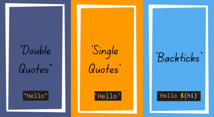

# Java Script

## Table of Contents

> - 01 What is a Method in js?
>
> - 2 String
>
> - 3 Number

## What is a Method in js?

> Методы JavaScript — это действия, которые могут выполняться над объектами.
> метод JavaScript — это свойство, содержащее Определение функции.

## Create js strings

## JAVA SCRIPT STRING METHODS

## JavaScript String method charAt()

> Метод charAt() возвращает указанный символ из строки.

## JavaScript String method concat()

> Метод concat() объединяет текст из двух или более строк и возвращает новую строку.

## JavaScript String method replace()

> Метод replace() возвращает новую строку с некоторыми или всеми сопоставлениями с шаблоном, заменёнными на заменитель.

## JavaScript String method replaceAll()

> Метод replaceAll() возвращает новую строку

## JavaScript String method split()

> Метод split() разбивает объект String на массив строк путём разделения строки указанной подстрокой.

## JavaScript String method substr(start, length)

> Метод substr() возвращает указанное количество символов из строки, начиная с указанной позиции.

## JavaScript String method substring(start,end)

> Метод substring() возвращает подстроку строки между двумя индексами, или от одного индекса и до конца строки.

## JavaScript String method slice(start, end)

> Метод slice() извлекает часть строки и возвращает новую строку без изменения оригинальной строки.

## JavaScript String method toLowerCase()

> Метод toLowerCase() возвращает значение строки, на которой он был вызван, преобразованное в нижний регистр.

## JavaScript String method toUpperCase()

> Метод toUpperCase() возвращает значение строки, на которой он был вызван, преобразованное в верхний регистр.

## JavaScript String method trim()

> Метод trim() удаляет пробельные символы с начала и конца строки.

## JavaScript String method includes()

> Метод includes() проверяет, содержит ли строка заданную подстроку, и возвращает, соответственно true или false.

## JavaScript String method search()

> Метод search() выполняет поиск сопоставления между регулярным выражением и этим объектом String.

## JavaScript String method toString()

> Метод toString() возвращает строку, представляющую указанный объект.

## JavaScript String method indexOf()

> Метод indexOf() возвращает индекс первого вхождения указанного значения в строковый объект String, на котором он был вызван, начиная с индекса fromIndex. Возвращает -1, если значение не найдено.

## JavaScript String method repeat()

> Метод repeat() конструирует и возвращает новую строку, содержащую указанное количество соединённых вместе копий строки, на которой он был вызван.

# JavaScript Number methods
